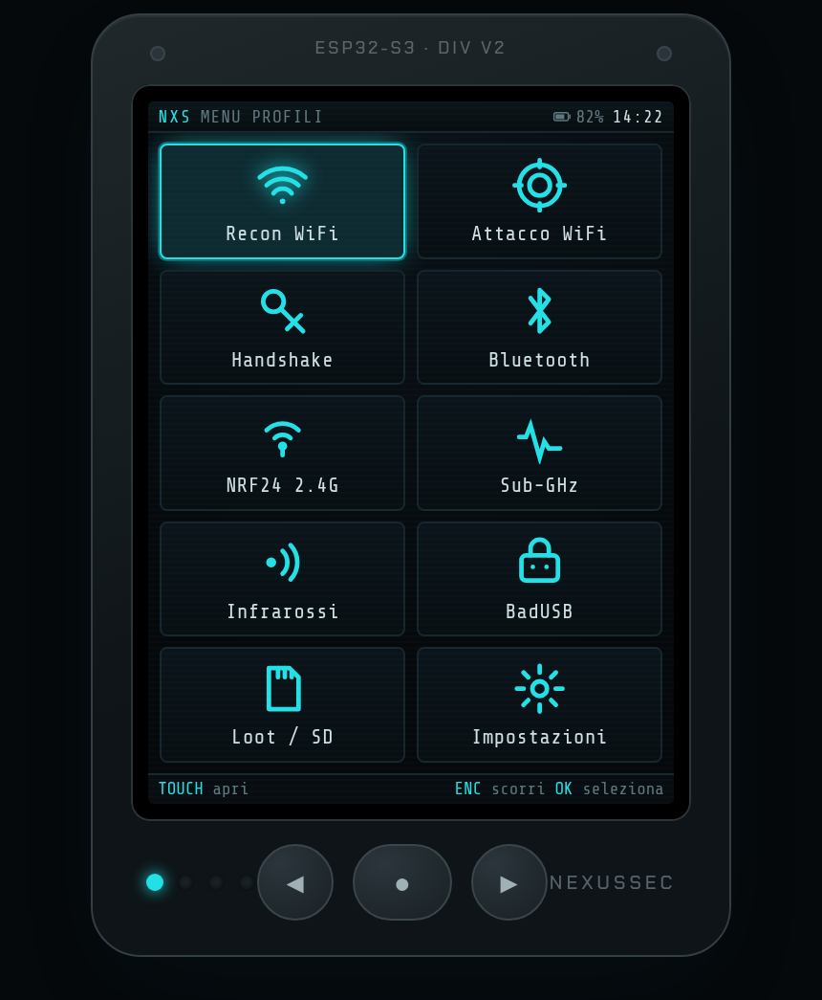
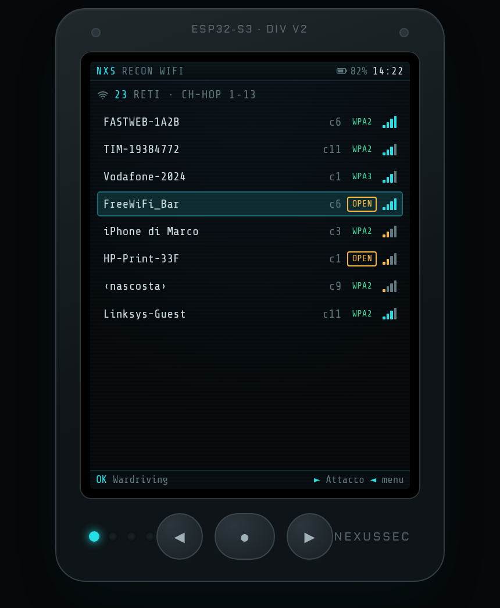
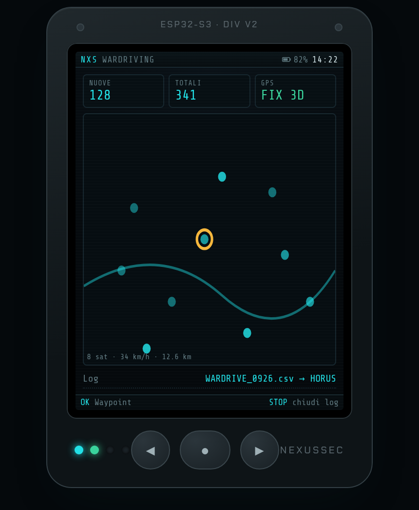
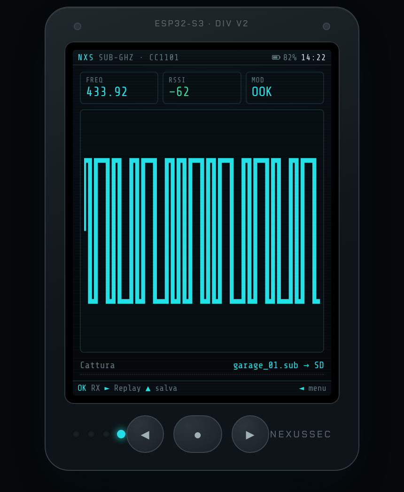
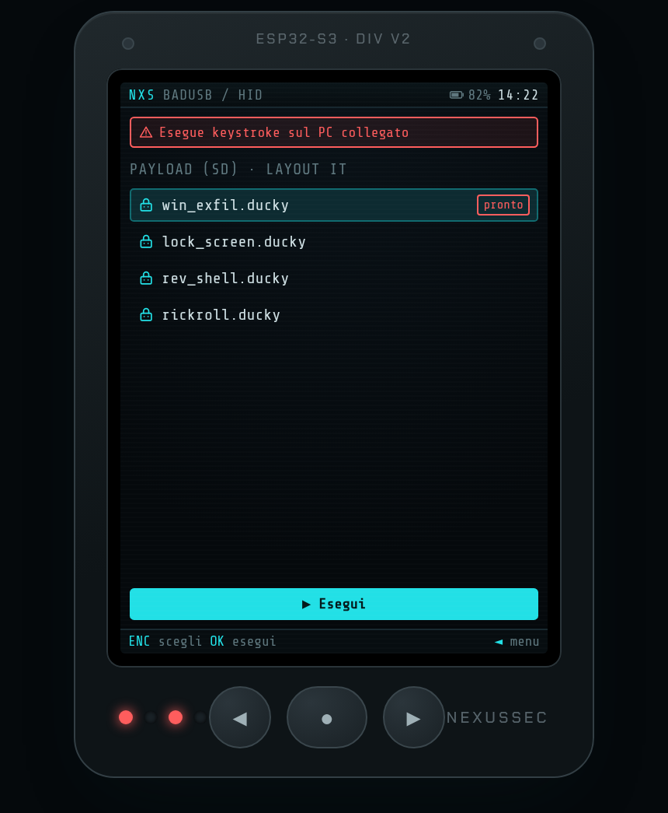

# NexusSec ESP32

**Sito**: https://redrider21.github.io/nexussec-esp32/ · **Flash dal browser**:
https://redrider21.github.io/nexussec-esp32/flash.html

Gadget hardware di **ricognizione wireless** basato su **ESP32-DIV V2** (ESP32-S3),
corollario dell'ecosistema **NexusSec** (distro NexusSec OS + app Termux-NexusSEC-OS
+ DE Vesper). Firmware **nostro** (Opzione B), brandizzato e integrato con la distro.

> **Stato**: firmware **v0.1.0 (beta)** — 8 moduli, **compila** su simulatore e
> scheda reale. ⚠️ **Non ancora testato su hardware fisico**: trattare come beta.

## Cos'è (e cosa non è)
L'ESP32-DIV V2 è un **microcontrollore**: non esegue Linux. Unisce più radio in un
gadget tascabile che la distro prepara (flash) e da cui riprende i dati.

- **Fa**: scan WiFi/BLE, wardriving, deauth/beacon-spam/rogue-AP*, PMKID/handshake*,
  2,4 GHz (NRF24), sub-GHz (CC1101), IR, BadUSB/HID, microSD.
- **Non fa**: WiFi 5 GHz, monitor-mode completo come una NIC vera, cracking pesante
  (lo fa il PC coi dati raccolti).

(*) funzioni offensive: solo su reti/dispositivi **autorizzati** (pentest/lab).

## Struttura del repository
```
nexussec-esp32/
├── firmware/                 # firmware nostro (Arduino-ESP32 + PlatformIO)
│   ├── platformio.ini        # env: esp32-div-v2 (sim) + esp32-div-v2-hw (reale)
│   ├── src/main.cpp          # boot+avviso, menu profili, tutti i moduli
│   ├── src/board_pins.h      # MAPPA PIN UFFICIALE ESP32-DIV V2
│   ├── wokwi.toml + diagram.json   # simulatore Wokwi
│   └── vendor/               # firmware ORIGINALE CiferTech (ripristino, MIT)
├── docs/                     # sito GitHub Pages
│   ├── index.html            # sito (con galleria screenshot + PCB)
│   ├── flash.html            # flasher web (ESP Web Tools)
│   ├── flash/                # manifest + bin per il flasher
│   ├── ui-mockup.html        # mockup interattivo dell'UI (kiosk: #kiosk:<schermata>)
│   ├── img/                  # screenshot UI + immagine hardware
│   ├── manuale.md            # MANUALE completo (uso + sviluppo)
│   └── nxs-esp32-integration.md   # specifica per il tool distro nxs-esp32
└── CLAUDE.md                 # note per l'assistente
```

## Moduli del firmware (menu a profili)
Recon WiFi · Wardriving (→CSV/HORUS) · Attacco WiFi* · Handshake/PMKID* · BLE ·
NRF24 (spettro 2,4 GHz) · Sub-GHz CC1101 · Infrarossi · BadUSB/HID · Loot/microSD ·
Impostazioni. **Doppio orientamento** (verticale/orizzontale) salvato in NVS.

## Interfaccia (screenshot)
Schermate del firmware sul display 320×240 (verticale), UI flat con accent cyan.

<p>
  
  
  
  
  
</p>

_Menu profili · Recon WiFi · Wardriving · Sub-GHz CC1101 · BadUSB._ Anteprima
interattiva: [`docs/ui-mockup.html`](docs/ui-mockup.html).

## Compilare
Serve **PlatformIO** (`pip install platformio`).
```bash
cd firmware
pio run                    # compila sim + hw
pio run -e esp32-div-v2    # solo simulatore
pio run -t upload          # flash via USB-C (esptool)
pio device monitor         # log seriale 115200
```

## Provare senza scheda (simulatore Wokwi)
VS Code + estensione **Wokwi**: `pio run`, apri `firmware/diagram.json`, premi Play.

## Flashare
- **Dal browser** (Chrome/Edge desktop): [flash.html](https://redrider21.github.io/nexussec-esp32/flash.html)
  — NexusSec (full) o ripristino firmware originale.
- **CLI**: `esptool.py --chip esp32s3 write_flash 0x0 docs/flash/bin/nexussec-esp32-full.bin`
- **Dalla distro** (in sviluppo): tool `nxs-esp32` — vedi
  [`docs/nxs-esp32-integration.md`](docs/nxs-esp32-integration.md).

## Integrazione con NexusSec OS
Flash con profilo via `nxs-esp32` (esptool) + import: wardriving → **HORUS**,
handshake/PMKID → **loot**. Specifica in `docs/nxs-esp32-integration.md`.

## Licenza ed etica
Firmware NexusSec: nostro. Il firmware **originale** in `firmware/vendor/` è di
**CiferTech** (licenza **MIT**), tenuto solo per il ripristino. Uso consentito
**solo su hardware/reti autorizzati**.

## Manuale
Guida completa (uso del dispositivo, ogni modulo, flash, sviluppo):
[`docs/manuale.md`](docs/manuale.md).
